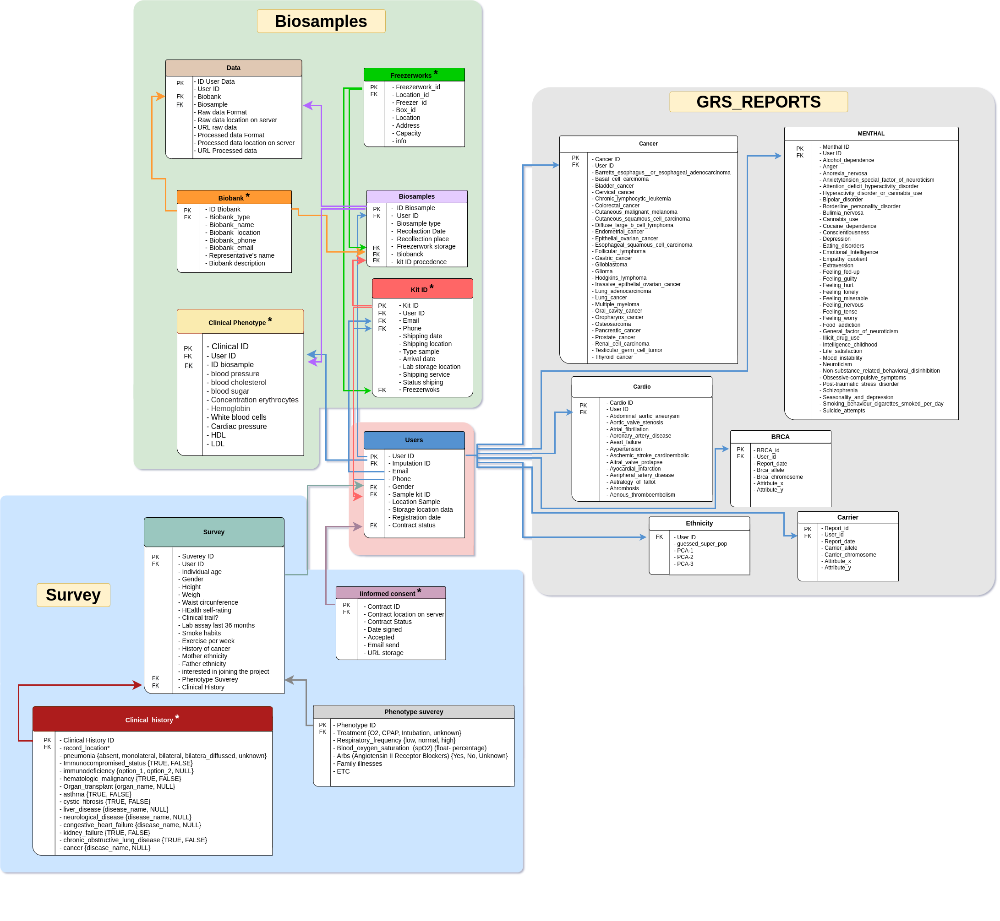

# OMICA DATABASE

The OMICA database is a compilation of mainly two types of files, storing survey data and polygenic risk reports. For this section, the MySQL tool is being used, as well as using a script written in python which automates the updating of the database.

In the **surveys section**, we find different tables which concentrate data extracted from surveys configured in the Typeform interface. Each survey has a self-updating live file loaded in Google Drive. Every certain time, a python script will be run which allows extracting the data present in the spreadsheet file to later load the new data in the database, storing it in the corresponding table of the survey.

On the other hand, in the **polygenic risk report** section, the data is extracted from unique JSON files per user, where different diseases are listed with a value associated with genetic risk based on their alleles. These data are segmented according to the category found, divided into tables such as cancer, BRCA, drug response, cardio, mental diseases, ethnicity, etc. (each of them will have a table in the database).
&nbsp;
&nbsp;

# **Data Base screening**

Additionally, we are currently working on big data models powered by Spark-hadoop in order to manage genomic data as well as data from the webapp.
# Data Base Structure

Relational database powered by MySQL **categorized into 4 sectors**
* **User:** Basic information about the user like email, gender, number phone, age, ID user, etc.
* **Surveys:** Personal and clinical information about the user lifestyle, familial illnesses and treatments.
* **Biosamples:** Control and correct administration of samples, involving additional information like biobank precedence, Freezerworks stored, server data, etc. 
* **Reports:** Processed report (data preset in webapp).

