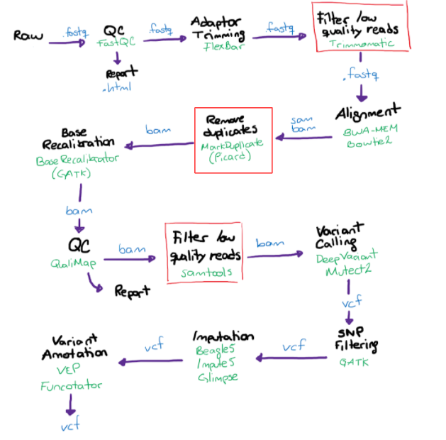

# Genome Analysis Pipeline Trial

The genome analysis pipeline is design to discover the genomic variants in Mexican and Latin American populations. This pipeline is an example used to analyze Illumina paired-end WGS raw data with the HG00152 sample 

## Workflow structure


<!---
Que es esta parte?
# Pipeline Workflow

   **Input file:** FASTQ (file obtained from Illumina lcWGS)
  Count-score = Σ Effect-count of SNP alleles (I)
--->

## Requirements and installation

**Reference files**

All reference files can be found in [Omica's Google Cloud Bucket](https://console.cloud.google.com/storage/browser/latch-omica-test/hg38/).
The sample files can also be found in  [Omica's Google Cloud Bucket](https://console.cloud.google.com/storage/browser/latch-omica-test/HG00152).

1. Download raw data 
```
mkdir HG00152 
cd HG00152

wget https://storage.googleapis.com/latch-omica-test/HG00152/HG00152_1.fastq.gz . 
wget https://storage.googleapis.com/latch-omica-test/HG00152/HG00152_2.fastq.gz . 
gunzip HG00152_1.fastq.gz
gunzip HG00152_2.fastq.gz

cd .. 
```
2. Download genomes & bundle files
```
mkdir GRCh38
cd GRCh38

wget https://storage.googleapis.com/latch-omica-test/hg38/Homo_sapiens_assembly38.fasta . 
wget https://storage.googleapis.com/latch-omica-test/hg38/Homo_sapiens_assembly38.fasta.fai . 

wget https://storage.googleapis.com/latch-omica-test/hg38/resources_broad_hg38_v0_Homo_sapiens_assembly38.dbsnp138.vcf .
wget https://storage.googleapis.com/latch-omica-test/hg38/resources_broad_hg38_v0_Homo_sapiens_assembly38.dbsnp138.vcf.idx .
wget https://storage.googleapis.com/latch-omica-test/hg38/Mills_and_1000G_gold_standard.indels.hg38.vcf.gz .
wget https://storage.googleapis.com/latch-omica-test/hg38/Mills_and_1000G_gold_standard.indels.hg38.vcf.gz.tbi .

cd ..
```

**BWA-MEM**
```
sudo apt update
sudo apt install bwa
```

**Samtools**
```
wget https://github.com/samtools/samtools/releases/download/1.9/samtools-1.9.tar.bz2
bunzip2 samtools-1.9.tar.bz2
tar -xvf samtools-1.9.tar
cd samtools-1.9
make
export PATH="/root/downloads/samtools/samtools-1.9/:$PATH"
```

**FastQC**
```
sudo apt-get update
sudo apt-get install fastqc
```

**GATK**
```
wget https://github.com/broadinstitute/gatk/releases/download/4.2.5.0/gatk-4.2.5.0.zip
gunzip gatk-4.2.5.0.zip.gz
unzip gatk-4.2.5.0.zip
export PATH="/root/downloads/gatk/gatk-4.2.5.0/:$PATH"
```

**Picard**
```
wget https://github.com/broadinstitute/picard/releases/download/2.18.15/picard.jar -O picard.jar
java -jar picard.jar
```

**DeepVariant**

Requires Docker.

Install Docker
```
sudo apt-get update
sudo apt-get install \
    apt-transport-https \
    ca-certificates \
    curl \
    gnupg \
    lsb-release
curl -fsSL https://download.docker.com/linux/ubuntu/gpg | sudo gpg --dearmor -o /usr/share/keyrings/docker-archive-keyring.gpg
echo "deb [arch=amd64 signed-by=/usr/share/keyrings/docker-archive-keyring.gpg] https://download.docker.com/linux/ubuntu \
  $(lsb_release -cs) stable" | sudo tee /etc/apt/sources.list.d/docker.list > /dev/null
sudo apt-get update
sudo apt-get install docker-ce docker-ce-cli containerd.io
```

Verify Docker installation by running
```
sudo docker run hello-world
```

Install deepvariant docker image
```
BIN_VERSION="1.5.0"
sudo apt -y update
sudo apt-get -y install docker.io
sudo docker pull google/deepvariant:"${BIN_VERSION}"
```

# Workflow

### Reads Quality Control
Input: FASTQ files.
Output: Quality control reports for each file in input.

**Prepare the environment**
```
mkdir QualityControl
cd QualityControl

ln -s ../HG00152/HG00152_1.fastq
ln -s ../HG00152/HG00152_2.fastq
```
**Run FastQC**
```
fastqc HG00152_1.fastq HG00152_2.fastq
```

### Validate order of paired-end reads
Download this [script](https://www.dropbox.com/s/chhuv207z5l4kdc/FastqPairedEndValidator.pl) for validation.
```
perl ./FastqPairedEndValidator.pl HG00152_1.fastq HG00152_2.fastq
```

### Alignment using BWA-MEM

**Prepare the environment**
```
mkdir Alignment
cd Alignment
cp /root/downloads/GRCh38/Homo_sapiens_assembly38.fasta .
cp /root/downloads/GRCh38/Homo_sapiens_assembly38.fasta.fai .
cp /root/downloads/HG00152/HG00152_1.fastq .
cp /root/downloads/HG00152/HG00152_2.fastq .
```
**Index reference genome**
This process needs to be done only once.
```
bwa index Homo_sapiens_assembly38.fasta 
```

**Align FASTQ files**
```
bwa mem -M -t 20 Homo_sapiens_assembly38.fasta HG00152_1.fastq HG00152_2.fastq > HG00152_BWAMEM.sam
```

**Convert sam to bam**
```
samtools view -S -b HG00152_BWAMEM.sam > HG00152_BWAMEM.bam
```

**Sort bam**
```
samtools sort -o HG00152_BWAMEM_sorted.bam -O bam -@ 20 HG00152_BWAMEM.bam
```

### Recalibration 

**Prepare the environment**
```
mkdir Recalibration
cd Recalibration 
cp ../GRCh38/Homo_sapiens_assembly38.fasta .
ln -s ../Alignment/HG00152_BWAMEM_sorted.bam .
```

**Build reference dictionary with picard**
```
java -jar picard.jar CreateSequenceDictionary R= ../GRCh38/Homo_sapiens_assembly38.fasta O= ../Alignment/Recalibration/Homo_sapiens_assembly38.dict 
```

**Index FASTA & BAM files**
```
samtools faidx Homo_sapiens_assembly38.fasta
samtools index HG00152_BWAMEM_sorted.bam
```

**Read Groups Check**

Make sure read groups are defined using samtools & picard
```
samtools view -H HG00152_BWAMEM_sorted_RG.bam | grep '@RG' | head
java -jar picard.jar AddOrReplaceReadGroups I= HG00152_BWAMEM_sorted.bam O= HG00152_BWAMEM_sorted_RG.bam RGID=HG00152 RGLB=lib2 RGPL=ILLUMINA RGPU=HG00152 RGSM=HG00152
```

**Obtain base recalibration table**
```
gatk BaseRecalibrator -R Homo_sapiens_assembly38.fasta -I HG00152_BWAMEM_sorted_RG.bam --known-sites resources_broad_hg38_v0_Homo_sapiens_assembly38.dbsnp138.vcf --known-sites Mills_and_1000G_gold_standard.indels.hg38.vcf.gz -O recal_data.table
```

**Apply BQSR**
```
gatk ApplyBQSR -R Homo_sapiens_assembly38.fasta -I HG00152_BWAMEM_sorted_RG.bam --bqsr-recal-file recal_data.table -O HG00152_BWAMEM_sorted_RG_recal.bam
```

### Variant calling using DeepVariant

**Prepare the environment**
```
mkdir input
mkdir output
mkdir reference
cp ../Homo_sapiens_assembly38.fasta ../reference
cp ../Homo_sapiens_assembly38.fasta.fai ../reference
cp ../HG00152_BWAMEM_sorted_RG_recal.bam ../input
cp ../HG00152_BWAMEM_sorted_RG_recal.bai ../input
```

**Run deepvariant**
```
BIN_VERSION="1.5.0"
sudo docker run --name deepvariant \
  -v "${PWD}/input":"/input" \
  -v "${PWD}/output":"/output" \
  -v "${PWD}/reference":"/reference" \
  google/deepvariant:"${BIN_VERSION}" \
  /opt/deepvariant/bin/run_deepvariant \
  --model_type WGS \
  --ref /reference/Homo_sapiens_assembly38.fasta \
  --reads /input/HG00152_BWAMEM_sorted_RG_recal.bam \
  --output_vcf /output/HG00152_deepvariant.vcf.gz \
  --num_shards 20 \
  --intermediate_results_dir /output/intermediate_results_dir
```

**Unzip vcf (optional)**
```
bgzip HG00152_deepvariant.vcf.gz
```
