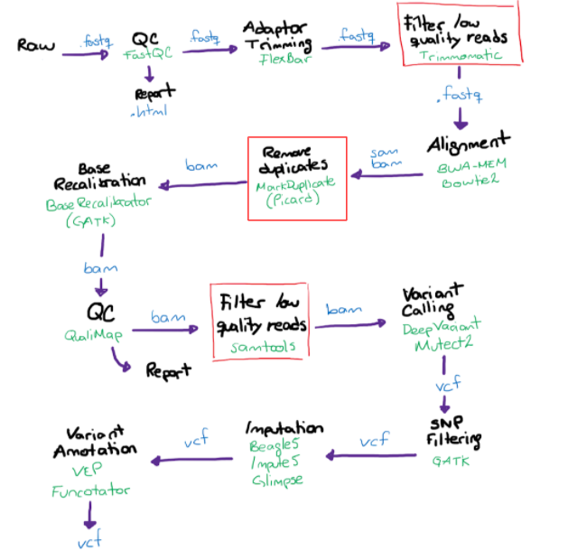

# Genome Analysis Pipeline v0.0.2

The genome analysis pipeline is design to discover the genomic variants in Mexican and Latin American populations. This pipeline is optimized to work with low coverage whole genome sequencing (lcWGS), from raw FASTQ files (multiplexed or demultiplexed) to imputed VCF files, leveraging systematized bioinformatic algorithms.

## Workflow structure


<!---
Que es esta parte?
# Pipeline Workflow

   **Input file:** FASTQ (file obtained from Illumina lcWGS)
  Count-score = Σ Effect-count of SNP alleles (I)
--->

## Requirements and installation

**Reference files**

All reference files can be found in [Omica's Google Cloud Bucket](https://console.cloud.google.com/storage/browser/latch-omica-test).

**Sabre**

For demultiplexing, requires Zlib.
```
wget https://github.com/najoshi/sabre/archive/refs/heads/master.zip
unzip master.zip
sudo apt install zlib1g-dev
cd sabre-master/
make
```

**BWA-MEM**
```
sudo apt update
sudo apt install bwa
```

**Samtools**
```
wget https://github.com/samtools/samtools/releases/download/1.9/samtools-1.9.tar.bz2
bunzip2 samtools-1.9.tar.bz2
tar -xvf samtools-1.9.tar
cd samtools-1.9
make
```

**FastQC**

```
sudo apt-get update
sudo apt-get install fastqc
```

**Multiqc**
```
pip3 install multiqc
multiqc --help
```

**Flexbar**
```
wget https://github.com/seqan/flexbar/releases/download/v3.4.0/flexbar-3.4.0-linux.tar.gz
tar -xzvf flexbar-3.4.0-linux.tar.gz
```

**GATK**
```
wget https://github.com/broadinstitute/gatk/releases/download/4.2.5.0/gatk-4.2.5.0.zip
gunzip gatk-4.2.5.0.zip
```

**Picard**
```
wget https://github.com/broadinstitute/picard/releases/download/2.18.15/picard.jar -O picard.jar
java -jar picard.jar
```

**DeepVariant**

Requires Docker.

Install Docker
```
sudo apt-get update
sudo apt-get install \
    apt-transport-https \
    ca-certificates \
    curl \
    gnupg \
    lsb-release
curl -fsSL https://download.docker.com/linux/ubuntu/gpg | sudo gpg --dearmor -o /usr/share/keyrings/docker-archive-keyring.gpg
echo "deb [arch=amd64 signed-by=/usr/share/keyrings/docker-archive-keyring.gpg] https://download.docker.com/linux/ubuntu \
  $(lsb_release -cs) stable" | sudo tee /etc/apt/sources.list.d/docker.list > /dev/null
sudo apt-get update
sudo apt-get install docker-ce docker-ce-cli containerd.io
apt-cache madison docker-ce
sudo apt-get install docker-ce=5:18.09.1~3-0~ubuntu-xenial docker-ce-cli=5:18.09.1~3-0~ubuntu-xenial containerd.io
```

Verify Docker installation by running

```
sudo docker run hello-world
```

**GLIMPSE**
```
sudo apt install build-essential
```

Required libraries

GLIMPSE requires two libraries installed on the system:

1.	HTSlib version >= 1.7: A C library for reading/writing high-throughput sequencing data.
2.	BOOST version >= 1.65: A set of peer-reviewed portable C++ source libraries. GLIMPSE uses two specific BOOST libraries: iostreams and program_options

```
wget https://github.com/samtools/htslib/releases/download/1.11/htslib-1.11.tar.bz2
tar -xf htslib-1.11.tar.bz2
mv htslib-1.11 htslib
cd htslib
autoheader; autoconf; ./configure; #optional
make

wget https://boostorg.jfrog.io/artifactory/main/release/1.73.0/source/boost_1_73_0.tar.bz2
tar --bzip2 -xf boost_1_73_0.tar.bz2
cd boost_1_73_0
./bootstrap.sh --with-libraries=iostreams,program_options --prefix=../boost #where ../boost is your custom boost installation prefix
./b2 install
cd ../boost #change this to the folder you used as --prefix for the bootstrap script
```

Make sure that the following standard library flags can be used by g++ on your system:
```
•	-lz, -lbz2 and -llzma for reading/writing compressed files.
•	-lm for basic math operations.
•	-lpthread for multi-threading.
```

You can do so by checking the outcome of the following commands:
```
locate -b '\libz.so'
locate -b '\libbz2.so'
locate -b '\liblzma.so'
locate -b '\libm.so'
locate -b '\libpthread.so'
locate -b '\libcurl.so'
```

Download the last version of the GLIMPSE code using:
```
git clone https://github.com/odelaneau/GLIMPSE.git
```
Navigate to the downloaded folder using cd GLIMPSE.

In order to compile a specific tool of the suite, for example GLIMPSE_phase, go in directory of the software (cd phase) and edit the specific makefile at lines 26-32 (desktop) so that the following variables are correctly set up (look at the paths already there for an example):

•	HTSSRC (line 26): path to the root of the HTSlib library, the prefix for HTSLIB_INC and HTSLIB_LIB paths,

•	HTSLIB_INC (line 27): path to the HTSlib header files,

•	HTSLIB_LIB (line 28): path to the static HTSlib library (file libhts.a),

•	BOOST_INC (line 29): path to the BOOST header files (often /usr/include),

•	BOOST_LIB_IO (line 30): path to the static BOOST iostreams library (file libboost_iostreams.a),

•	BOOST_LIB_PO (line 31): path to the static BOOST program_options library (file libboost_program_options.a),

If installed at the system level, static libraries (*.a files) can be located with this command:

locate libboost_program_options.a libboost_iostreams.a libhts.a

Once all paths correctly set up, proceed with the compilation using make. The binary can be found in the bin/ folder and will have a name similar to GLIMPSE_phase. You will need to copy the modified makefile in each tool (folder) of the GLIMPSE toolsuite


# Workflow

### Demultiplexing using Sabre (optional)

Requires a text file mapping sampleID and barcode, see example [here](https://github.com/najoshi/sabre#barcode-data-file-format-for-paired-end).

Input: Paired-end reads FASTQ files.

Output: Demultiplexed FASTQ files; any reads with unknown barcodes are put into the "unknown" file specified on the command line.
```
sabre pe -c -f input_file1.fastq -r input_file2.fastq -b barcode_data.txt -u unknown_barcode1.fastq -w unknown_barcode2.fastq
```

### Reads Quality Control

Input: FASTQ files.

Output: Quality control reports for each file in input.

MultiQC can be use to aggregate all FastQC reports into one.
```
fastqc input_1.fastq input_2.fastq
```

### Remove adapters using FlexBar (optional)

Requires adapter sequences in FASTA format. More information about options can be found [here](https://github.com/seqan/flexbar).
```
flexbar --reads input_1.fastq --reads2 input_2.fastq [-t target] [-b barcodes] [-a adapters] [options]
```

### Validate order of paired-end reads

Download this [script](https://www.dropbox.com/s/chhuv207z5l4kdc/FastqPairedEndValidator.pl) for validation.
```
perl ./FastqPairedEndValidator.pl input_1.fastq input_2.fastq
```

### Align using BWA-MEM

**Index reference genome**

This process needs to be done only once.
```
bwa index -p ref_genome reference_genome.fastq
```

**Aligment FASTQ**

The number of threads dedicated it could be specified with the flag -t
```
bwa mem -M -t 22 \
reference_data/ref_genome \
qc_data/data_1.fq qc_data/data_2.fq \
> results/data.sam
```

### Convert sam to bam 

```
samtools view -S -b na12878.sam > sample.bam
```

### Sort bam using samtools

Number of threads used can be specified in *-@*.
```
samtools sort -o bwamem_38_sorted.bam -O bam -@ threads bwamem_38.bam
```

<!---
For design purposes
### Alignment metrics using samtools
```
samtools flagstat HG00152_bwamem_38_sorted.bam > alignment_bwamem_metrics.txt
```
--->

### Base quality score recalibration

Build reference dictionary using Picard from FASTA reference genome.
```
java -jar picard.jar CreateSequenceDictionary R=References/Homo_sapiens_assembly38.fasta O=References/Homo_sapiens_assembly38.dict
```

Index FASTA file
```
samtools faidx Homo_sapiens_assembly38.fasta
```

Index BAM file
```
samtools index HG00152_bwamem_38_sorted.bam
```

Make sure read groups are defined using Picard (example)
```
java -jar picard.jar AddOrReplaceReadGroups I= BWA_sort.bam O= BWA_sort_RG1.bam RGID=1 RGLB=lib2 RGPL=illumina RGPU=unit1 RGSM=SampleID
```

Analyze covariation
```
gatk BaseRecalibrator -R References/Homo_sapiens_assembly38.fasta -I BWA_sort_RG1.bam --known-sites References/Homo_sapiens_assembly38.dbsnp138.vcf --known-sites References/Mills_and_1000G_gold_standard.indels.hg38.vcf -O recal_data.table
```

Apply BQSR
```
gatk ApplyBQSR -R ../References/Homo_sapiens_assembly38.fasta -I HG00152_bwamem_38_sorted.bam --bqsr-recal-file recal_data.table -O HG00152_bwamem_38_sorted_recal.bam
```

### Variant calling using DeepVariant

Declare paths
```
BIN_VERSION="1.4.0"
BASE="${HOME}"
INPUT_DIR="${BASE}/BWA_out"
REF="Homo_sapiens.GRCh37.dna.primary_assembly.fa"
BAM="input.sorted.bam"
OUTPUT_DIR="${BASE}/output"
DATA_DIR="${INPUT_DIR}"
OUTPUT_VCF="out.vcf.gz"
```
Region and number of cores can be specified.
```
sudo docker run \
	-v "${DATA_DIR}":"/input" \
	-v "${OUTPUT_DIR}:/output" \
	-v "${HOME}:${HOME}" \
	gcr.io/deepvariant-docker/deepvariant:"${BIN_VERSION}" \
	/opt/deepvariant/bin/run_deepvariant \
	--model_type=WGS \
	--ref="${BASE}/References/reference_genome/${REF}" \
	--reads="${DATA_DIR}/${BAM}" \
	--output_vcf=/output/${OUTPUT_VCF} \
	--num_shards=14 \
	--intermediate_results_dir /output/intermediate_results_dir
```

BGZIP DeepVariant VCF output.
```
bgzip in.vcf
```

Index the bgzipped VCF file.
```
bcftools index in.vcf.gz
```

Split result by chromosome.
```
bcftools index -s in.vcf.gz | cut -f 1 | while read C; do bcftools view -O z -o split.${C}.vcf.gz in.vcf.gz "${C}" ; done
```

### Imputation with GLIMPSE

Run the following bash script to run the imputation on all the chromosomes in sequence.

All FASTA reference chromosomes must be in a folder named *reference_genome*; all reference panels must be in folder *reference_panel*.
Please refer to the bash script to see other important comments and files location.
```
bash GLIMPSE-all-chrs.sh
```

To run the parallelized version of GLIMPSE run:
```
bash Glimpse-parallel.sh -t [number of threads]
```

